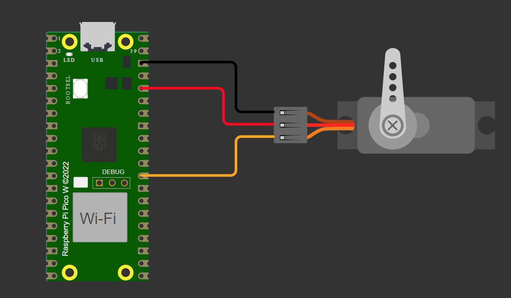

# Controle de Servo Motor e LED RGB com RP2040

## Descrição
Este projeto tem como objetivo controlar um servo motor e um LED RGB utilizando o microcontrolador RP2040. A movimentação do servo é feita através de sinais PWM, enquanto o brilho do LED RGB é ajustado proporcionalmente à posição do servo. O código é desenvolvido em linguagem C utilizando o **Pico SDK** e pode ser simulado no **Wokwi**.

## Componentes Utilizados
- **Microcontrolador:** Raspberry Pi Pico (RP2040)
- **Servo motor:** Micro Servo padrão (exemplo: SG90)
- **LED RGB:** Controlado por PWM
- **Fonte de alimentação:** 5V ou compatível com os componentes
- **Resistores:** Se necessário para limitar corrente no LED

## Configuração do PWM
O sinal PWM é utilizado para controlar tanto o servo motor quanto o LED RGB:
- **Servo motor:** Frequência de **50Hz** (período de **20ms**), com largura de pulso variando entre:
  - **500µs** → 0°
  - **1470µs** → 90°
  - **2400µs** → 180°
- **LED RGB:** Controlado por PWM, com brilho proporcional à posição do servo motor.

## Estrutura do Código
O código principal é composto pelas seguintes funções:
- `set_servo_pulse(gpio, pulse_width_us)`: Configura o sinal PWM no pino do servo motor para um determinado pulso.
- `set_led_brightness(pulse_width_us)`: Ajusta o brilho do LED RGB de forma proporcional à posição do servo.
- `move_servo_smoothly(start, end)`: Move o servo de maneira gradual entre dois ângulos, garantindo transição suave.
- `main()`: Loop principal que realiza o controle do servo motor e do LED RGB em ciclos predefinidos.

## Clonando o Repositório
Para obter o código-fonte do projeto, execute os seguintes comandos no terminal:
```sh
git clone https://github.com/jonathasporto/PWM-servomotor-led.git
cd PWM-servomotor-led
```

## Compilação e Execução
1. **Configurar o ambiente de desenvolvimento:**
   - Instalar o **Pico SDK** e configurar as variáveis de ambiente.
   - Certificar-se de que o **CMake** e **Make** estão instalados.
   
2. **Compilar o código:**
   ```sh
   mkdir build
   cd build
   cmake ..
   make
   ```

3. **Transferir o arquivo para a placa:**
   - Conectar o **Raspberry Pi Pico** ao computador segurando o botão **BOOTSEL**.
   - Montar o drive **RPI-RP2** no sistema.
   - Copiar o arquivo **.uf2** gerado para o drive montado.

## Simulação no Wokwi
O projeto pode ser simulado no **Wokwi** para testar seu funcionamento antes da implementação no hardware real. Certifique-se de utilizar a configuração adequada no simulador, conectando corretamente os componentes.




## Video de Funcionamento

[AQUI!]()

